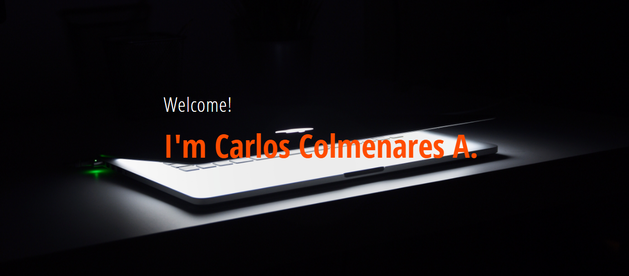

 

---

 

### 
<h3>Is a complete, responsive and Multi-page HTML, CSS & Javascript website</h3>

 

### 
<h5>Include</h5>

 
<ul style="text-align:justify; font-size:12x">
<li>Menu navigation management </li>
<li>Background heros images and videos</li>
<li>Use of animations libraries for images and cards</li>
<li>Use of icons libraries</li>
<li>Use of font libraries</li>
<li>Use of Flexbox and Grid technologies</li>
<li>HTML Form for contact management through 3er-parties</li>
<li>A lot of Javascript routines for multiple effects</li>
<li>Responsive techniques for different devices, such a variables for font-sizes, Clamp, colors, width and height, etc.</li>
</ul>
